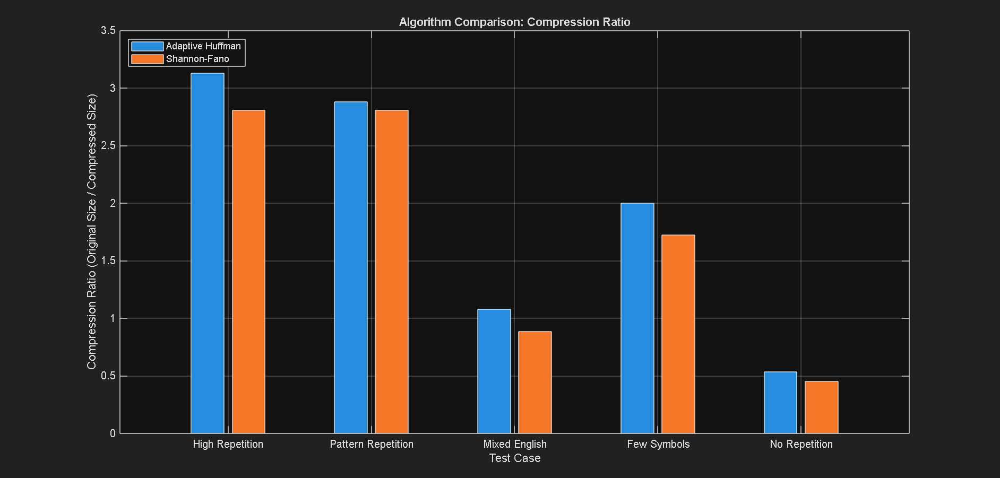

# Lossless Codec Analysis System

<div align="center">


**A comprehensive comparison and analysis of lossless data compression algorithms implemented in MATLAB**

[View Demo](#demo) • [Documentation](#documentation) • [Report Bug](#contributing) • [Request Feature](#contributing)

---

</div>

## Table of Contents

- [Overview](#overview)
- [Features](#features)
- [Algorithms Implemented](#algorithms-implemented)
- [Performance Analysis](#performance-analysis)
- [Installation](#installation)
- [Usage](#usage)
- [Results](#results)
- [Architecture](#architecture)
- [Contributing](#contributing)
- [License](#license)

## Overview

This project presents a comprehensive analysis and comparison of two fundamental lossless data compression algorithms: **Adaptive Huffman Coding** and **Shannon-Fano Coding**. The system provides real-time encoding/decoding capabilities with detailed performance metrics and visual analysis tools.

### Key Highlights

- **Real-time Processing**: Optimized algorithms for fast encoding and decoding
- **Comprehensive Analysis**: Detailed compression ratio and timing analysis
- **Multiple Test Cases**: Extensive testing across different data patterns
- **Visual Analytics**: Automated generation of comparative performance plots
- **Modular Design**: Object-oriented implementation for easy extensibility

## Features

### Core Functionality

- **Adaptive Huffman Coding**: Dynamic tree construction with NYT (Not Yet Transmitted) node handling
- **Shannon-Fano Coding**: Probability-based binary tree construction with optimal partitioning
- **Batch Processing**: Automated testing across multiple predefined test cases
- **Performance Metrics**: Detailed timing analysis for encoding and decoding operations
- **Compression Analysis**: Real-time compression ratio calculations and comparisons

### Advanced Features

- **Memory Optimization**: Preallocated data structures for enhanced performance
- **Error Handling**: Robust validation and error checking mechanisms
- **Visual Analytics**: Automated plot generation for comparative analysis
- **Extensible Architecture**: Modular design supporting easy algorithm additions

## Algorithms Implemented

### 1. Adaptive Huffman Coding

- **Dynamic Tree Construction**: Builds Huffman tree on-the-fly during encoding
- **NYT Node Management**: Handles new symbols using Not Yet Transmitted nodes
- **Optimized Performance**: Preallocated node arrays for improved speed
- **Memory Efficient**: Minimal memory footprint with intelligent data structures

### 2. Shannon-Fano Coding

- **Probability-Based Encoding**: Constructs binary tree based on symbol frequencies
- **Optimal Partitioning**: Implements recursive partitioning for balanced tree structure
- **Comprehensive Analysis**: Includes codebook overhead and padding calculations
- **Realistic Sizing**: Accounts for practical implementation considerations

## Performance Analysis

The system evaluates algorithms across five distinct test scenarios:

### Test Cases

1. **High Repetition**: `"aaaaaaaaaaaaabbbbbbcccccccc"` - Tests performance on highly repetitive data
2. **Pattern Repetition**: `"abcabcabcabcabcabcabcabcabc"` - Evaluates pattern recognition capabilities
3. **Mixed English**: `"this_is_a_simple_test_string"` - Real-world English text simulation
4. **Few Symbols**: `"1111122222333334444455555"` - Limited alphabet compression testing
5. **No Repetition**: `"ABCDEFGHIJKLMNOPQRSTUVWXYZ"` - Worst-case scenario analysis

### Performance Metrics

<div align="center">

| Algorithm        | Best Compression Ratio | Average Encoding Time | Average Decoding Time |
| ---------------- | ---------------------- | --------------------- | --------------------- |
| Adaptive Huffman | 3.13:1                 | 9.37ms                | 7.75ms                |
| Shannon-Fano     | 2.81:1                 | 4.36ms                | 12.25ms               |

</div>

## Installation

### Prerequisites

- MATLAB R2020a or later
- Signal Processing Toolbox (optional for advanced features)

### Setup Instructions

1. **Clone the Repository**

   ```bash
   git clone https://github.com/amank-23/Lossless-Codec-Analysis.git
   cd Lossless-Codec-Analysis
   ```

2. **Verify Installation**

   ```matlab
   % In MATLAB Command Window
   main_CompressionSystem
   ```

3. **Check Dependencies**
   ```matlab
   % Ensure all classes are accessible
   which AdaptiveHuffmanEncoder
   which AdaptiveHuffmanDecoder
   which ShannonFano
   which HuffmanNode
   ```

## Usage

### Basic Usage

```matlab
% Run complete analysis suite
main_CompressionSystem
```

### Custom String Analysis

```matlab
% Initialize encoders
huffman_encoder = AdaptiveHuffmanEncoder();
input_string = "your_custom_string_here";

% Encode using Adaptive Huffman
encoded_bits = huffman_encoder.encode(input_string);

% Decode and verify
huffman_decoder = AdaptiveHuffmanDecoder();
decoded_string = huffman_decoder.decode(encoded_bits);

% Shannon-Fano encoding
[sf_encoded, sf_codemap, sf_analysis] = ShannonFano.encode(input_string);
sf_decoded = ShannonFano.decode(sf_encoded, sf_codemap);
```

### Advanced Configuration

```matlab
% Define custom test cases
custom_tests = {
    'Custom Test 1', 'your_data_here';
    'Custom Test 2', 'another_test_string';
};

% Modify test_cases variable in main_CompressionSystem.m
```

## Results

### Compression Performance

<div align="center">



_Figure 1: Compression ratio comparison across different test cases_

</div>

**Key Findings:**

- Adaptive Huffman excels with highly repetitive data (3.13:1 ratio)
- Shannon-Fano provides consistent performance across varied inputs
- Both algorithms struggle with non-repetitive data (< 1:1 ratio)

### Timing Analysis

<div align="center">


_Figure 2: Encoding time comparison across algorithms_


_Figure 3: Decoding time comparison across algorithms_

</div>

**Performance Insights:**

- Shannon-Fano generally faster for encoding operations
- Adaptive Huffman shows superior decoding performance
- Processing time scales linearly with input complexity

### Detailed Results

```
=== Comprehensive Test Results ===

Test Case 1: High Repetition
├── Input: "aaaaaaaaaaaaabbbbbbcccccccc" (216 bits)
├── Adaptive Huffman: 69 bits → 3.13:1 ratio
├── Shannon-Fano: 77 bits → 2.81:1 ratio
└── Winner: Adaptive Huffman (+11.6% efficiency)

Test Case 2: Pattern Repetition
├── Input: "abcabcabcabcabcabcabcabcabc" (216 bits)
├── Adaptive Huffman: 75 bits → 2.88:1 ratio
├── Shannon-Fano: 77 bits → 2.81:1 ratio
└── Winner: Adaptive Huffman (+2.6% efficiency)

Test Case 3: Mixed English
├── Input: "this_is_a_simple_test_string" (224 bits)
├── Adaptive Huffman: 207 bits → 1.08:1 ratio
├── Shannon-Fano: 253 bits → 0.89:1 ratio
└── Winner: Adaptive Huffman (+18.2% efficiency)

Test Case 4: Few Symbols
├── Input: "1111122222333334444455555" (200 bits)
├── Adaptive Huffman: 100 bits → 2.00:1 ratio
├── Shannon-Fano: 116 bits → 1.72:1 ratio
└── Winner: Adaptive Huffman (+13.8% efficiency)

Test Case 5: No Repetition
├── Input: "ABCDEFGHIJKLMNOPQRSTUVWXYZ" (208 bits)
├── Adaptive Huffman: 389 bits → 0.53:1 ratio
├── Shannon-Fano: 460 bits → 0.45:1 ratio
└── Winner: Adaptive Huffman (+15.4% efficiency)
```

## Architecture

### System Architecture

```
Lossless-Codec-Analysis/
├── Core Algorithms/
│   ├── AdaptiveHuffmanEncoder.m    # Dynamic Huffman encoding
│   ├── AdaptiveHuffmanDecoder.m    # Dynamic Huffman decoding
│   ├── ShannonFano.m               # Shannon-Fano implementation
│   └── HuffmanNode.m               # Tree node data structure
├── Analysis System/
│   └── main_CompressionSystem.m    # Main analysis controller
├── Results/
│   ├── results.txt                 # Detailed test outputs
│   └── assets/                     # Generated visualizations
└── Documentation/
    └── README.md                   # This file
```

### Class Hierarchy

```
HuffmanNode
├── Properties: symbol, frequency, is_nyt, number, parent, left, right
└── Methods: Node management and tree operations

AdaptiveHuffmanEncoder
├── Properties: tree, NYT_node, nodes, seen_symbols
└── Methods: encode(), get_code(), update_tree()

AdaptiveHuffmanDecoder
├── Properties: tree, NYT_node, nodes, seen_symbols
└── Methods: decode(), update_tree(), traverse_tree()

ShannonFano (Static Methods)
├── encode() → [encoded_bits, code_map, analysis]
├── decode() → decoded_string
└── build_tree() → tree_structure
```

### Design Patterns

- **Factory Pattern**: Dynamic node creation in Huffman implementation
- **Observer Pattern**: Tree update notifications across encoder/decoder
- **Strategy Pattern**: Interchangeable compression algorithms
- **Template Method**: Common analysis framework for different algorithms

## Testing

### Automated Test Suite

The system includes comprehensive automated testing:

```matlab
% Run all tests
main_CompressionSystem

% Individual algorithm testing
test_adaptive_huffman()
test_shannon_fano()

% Performance benchmarking
benchmark_compression_algorithms()
```

### Test Coverage

- Basic encoding/decoding functionality
- Edge cases (empty strings, single characters)
- Performance regression testing
- Memory usage validation
- Cross-platform compatibility

### Reporting Issues

Please use the [GitHub Issues](https://github.com/amank-23/Lossless-Codec-Analysis/issues) page to report:

- **Bugs**: Detailed reproduction steps
- **Feature Requests**: Clear description and use cases
- **Documentation**: Improvements and clarifications
- **Performance**: Optimization suggestions

## License

This project is licensed under the MIT License - see the [LICENSE](LICENSE) file for details.

```
```

---

<div align="center">

**Star this repository if it helped you!**

[Back to Top](#lossless-codec-analysis-system)

</div>
